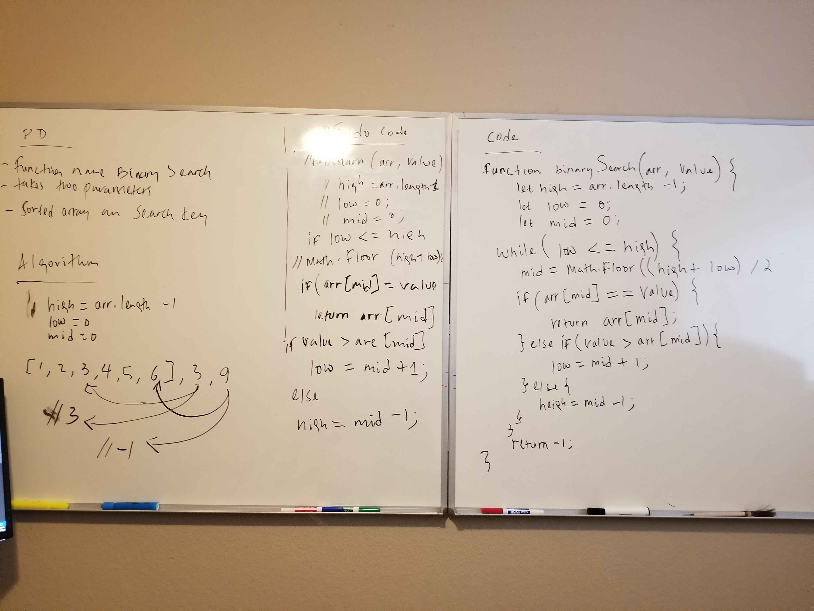

# Array Binary Search

## Challenge

* Write a function called BinarySearch which takes in 2 parameters: a sorted array and the search key. Without utilizing any of the built-in methods available to your language, return the index of the array’s element that is equal to the search key, or -1 if the element does not exist.

## Approach & Efficiency

* It was really big challenge but I found from google resource what binary is, as far as my understanding it searches half of the array and check if the given number is in the array if not in the array will return -1

## Solution

