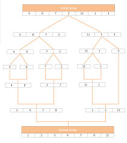

# Merge Sort

## Part 1 - Split arrays

After wefound the mid point of the given array and create two new arrays by adding the values of each half of the original array.

We make two recursive calls to the same mergeSort function we are in, this time passing in the left side array, and then the right side array. This continues to happen until the array is broken down to arrays of a single element, as shown above.

### Main Steps of the sort function 

1.  if array has only 1 element, nothing to do, return
2.  Find mid point of array
3.  Add left half of array of the left array
4.  And adding right half of array of the right array
5. sort left half of the array
6. sort right half of the array
7. merge sorted halves, modifying original array

